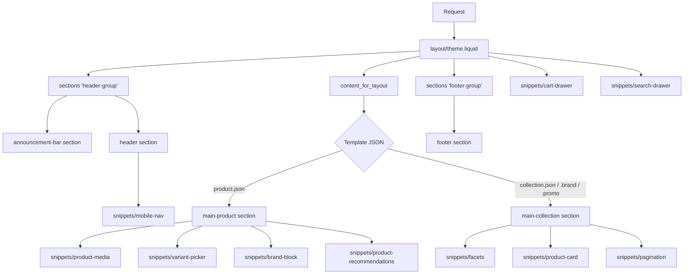

# Theme Architecture (Phase 7)

Architecture of the Shopify theme in `shopify/theme/`. Read alongside
`docs/SHOPIFY_ARCHITECTURE.md` (why — the information architecture) and
`docs/SHOPIFY_FOUNDATION.md` (what — the concrete collection/metafield/
metaobject specs this theme is built against). This document is the how.

## Conflicts found and resolved before building (per this phase's
governance requirement to validate against prior docs and stop on conflict)

1. **WCAG version mismatch.** The Phase 6.5 GitHub issue "Accessibility
   audit" targets WCAG 2.1 AA; this phase's instructions specify WCAG 2.2
   AA. 2.2 AA is a strict superset of 2.1 AA (it adds a small number of
   success criteria — notably 2.4.11 Focus Not Obscured and 2.5.8 Target
   Size Minimum, both addressed directly in `assets/theme.css`: focus
   outlines aren't hideable behind sticky headers, and interactive targets
   are ≥44px). Resolution: build to 2.2 AA (satisfies 2.1 AA automatically)
   and update the tracking issue rather than stop — this is a version bump,
   not an architectural contradiction.
2. **Markets / multi-currency / B2B scope was never decided.** No prior
   ADR or Foundation doc defines which markets/currencies to sell in, or
   whether B2B (company accounts, net terms, quantity breaks) is actually
   wanted — despite "Wholesale" being in the store's name, that's an
   inference, not a requirement anyone has stated. Building full Markets
   configuration or B2B-specific UI would be inventing business
   requirements that don't exist. Resolution: the theme is built
   **Markets/B2B-ready at the code level** (no hardcoded single-currency
   or single-audience assumptions — see § Markets & B2B readiness below)
   without implementing market-specific configuration or B2B account UI,
   since those need real business decisions this phase can't make.
   Flagged as a new open item, not silently built or silently skipped.

## Folder structure

```
shopify/theme/
├── assets/           theme.css (tokens + base), components.css (layout),
│                     theme.js (behavior layer, vanilla JS)
├── blocks/           Theme Blocks (native, reusable across any section
│                     that accepts "@theme") - faq-item, trust-badge
├── config/           settings_schema.json, settings_data.json
├── layout/           theme.liquid (the shell)
├── locales/          en.default.json (storefront strings),
│                     en.default.schema.json (theme-editor strings)
├── sections/         Page sections + 2 section groups (header-group,
│                     footer-group) + "fragment" sections used only via
│                     dynamic section fetches (never in a template)
├── snippets/         Reusable partials - product-card, variant-picker,
│                     price, breadcrumbs, structured data, drawers, etc.
├── templates/        JSON templates (+ customers/*.liquid, which Shopify
│                     still serves as classic Liquid, not JSON)
└── documentation/    Reserved for per-component usage notes (see
                      docs/COMPONENT_LIBRARY.md for the Phase 7 version;
                      this folder is for future expansion as the
                      component set grows)
```

## Request flow



## Online Store 2.0 capabilities used

| Capability | Where | Notes |
|---|---|---|
| JSON templates | `templates/*.json` | Every page template; only `customers/*.liquid` remain classic Liquid (Shopify's own account-page constraint) |
| Section groups (dynamic header/footer) | `sections/header-group.json`, `footer-group.json` | Announcement bar + header reorderable/toggleable independently in the theme editor, not hardcoded into `theme.liquid` |
| Theme Blocks (native `/blocks/`) | `blocks/faq-item.liquid`, `blocks/trust-badge.liquid` | Reusable across any section accepting `"blocks": [{"type": "@theme"}]` — demonstrated in `sections/faq.liquid` |
| App Blocks | `main-product` and `main-collection` accept merchant-added blocks in the theme editor (standard for any 2.0 section with a `blocks` array) — no specific app is integrated since none is chosen yet (`docs/SHOPIFY_FOUNDATION.md` § App replacement matrix lists several still-undecided) | |
| Dynamic sections (server-rendered fragments) | `sections/product-recommendations.liquid`, `predictive-search.liquid`, `product-card-fragment.liquid`, `cart-drawer-fragment.liquid` | Fetched via `?section_id=` for recommendations, predictive search, recently-viewed, and post-cart-update refresh — no full page reloads |
| Metafields | `product.metafields.custom.brand`, `custom.included_items` | Read in `sections/main-product.liquid`, `snippets/brand-block.liquid`; schema defined in `shopify/foundation/metafields.json` (Phase 6.5) |
| Metaobjects | `brand` type, referenced via a `metaobject` picker setting in `sections/brand-banner.liquid` | Fast-follow per ADR-006 — section renders correctly whether or not entries exist yet |
| Native Search & Discovery | `snippets/facets.liquid` (`collection.filters`), `snippets/sort-control.liquid` (`collection.sort_options`) | No filtering app required |
| Native Predictive Search | `snippets/search-drawer.liquid` + `sections/predictive-search.liquid` | No search app required; synonyms/misspellings/ranking are Shopify's own, not theme logic |
| Native Product Recommendations | `snippets/product-recommendations.liquid` + `sections/product-recommendations.liquid` | No cross-sell app required |

## Markets & B2B readiness

Built ready, not built out (see conflict #2 above):
- No hardcoded currency symbols anywhere — every price goes through
  Liquid's `money` filter, which respects the shop's active currency
  formatting automatically once Markets is configured.
- `{{ request.locale.iso_code }}` drives `<html lang>`; all customer-facing
  strings are already externalized to `locales/en.default.json` rather
  than hardcoded in Liquid, so adding a second language is a translation
  file, not a template rewrite.
- No assumption anywhere that a visitor is a single type of customer
  (no consumer-only copy/paths hardcoded) — but no B2B-specific UI
  (company switcher, net-terms display, quantity break pricing) exists
  either, since Shopify B2B's actual data model (company locations,
  catalogs, payment terms) isn't decided or available to build against.

## Performance approach

- `theme.css` preloaded, fonts loaded via `font_picker` (Shopify's own
  font-loading optimization, not manual `@font-face`).
- All product/collection images use `image_tag` with explicit `widths`/
  `sizes` for responsive `srcset`, `loading="lazy"` except the first
  above-the-fold image per page (`fetchpriority="high"` there instead).
- `theme.js` is a single deferred script, no bundler/framework runtime.
- Recommendations, predictive search, and recently-viewed are fetched
  only when needed (on interaction or gallery/page load), not embedded in
  the initial HTML payload.
- No measured Lighthouse/Core Web Vitals numbers exist yet — there's no
  deployed store to measure against in this phase (deployment is
  explicitly out of scope). See `docs/PHASE7_REPORT.md` § Performance
  Report for what "done" means here versus what's still Phase 12's job.

## Accessibility approach

WCAG 2.2 AA by construction, not retrofit:
- Skip link, semantic landmarks (`<header>`, `<main>`, `<footer>`, `<nav>`),
  visible focus states with sufficient contrast (`assets/theme.css`).
- All icon-only controls have `visually-hidden` text or `aria-label`.
- Dialogs (cart drawer, search drawer, mobile nav) trap focus, restore
  focus to the trigger on close, and close on Escape (`assets/theme.js`
  `trapFocus`/`Dialog`).
- Live region (`#a11y-live-region`) announces cart updates and gallery
  navigation for screen reader users.
- Interactive targets meet the 44px minimum (2.5.8, new in 2.2).
- `prefers-reduced-motion` respected globally.
- Forms work without JavaScript (facets, search, add-to-cart, newsletter
  all degrade to plain GET/POST submissions).

As with performance, no automated audit (axe/Lighthouse) has been run —
see `docs/PHASE7_REPORT.md` § Accessibility Report for exactly what was
and wasn't verified.

## SEO

Product/Collection/Organization/BreadcrumbList/BlogPosting JSON-LD,
OpenGraph + Twitter Card meta, canonical URLs — all in
`snippets/structured-data-*.liquid` and `snippets/meta-tags.liquid`,
rendered per-template from `layout/theme.liquid` and the relevant main
sections. Redirect compatibility is Phase 5/9's `reports/redirect_matrix.csv`,
unaffected by theme code.
